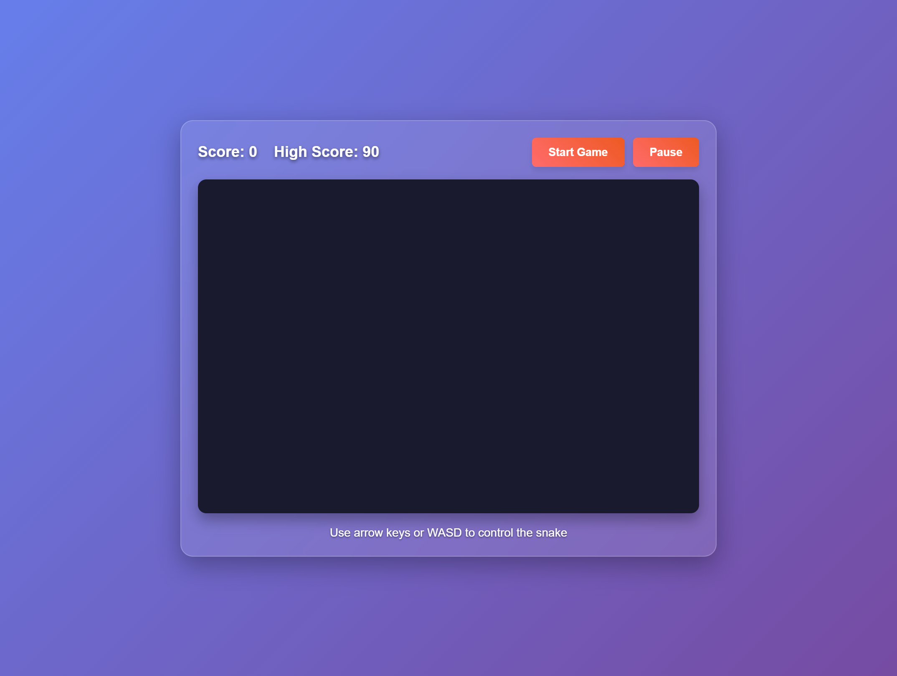
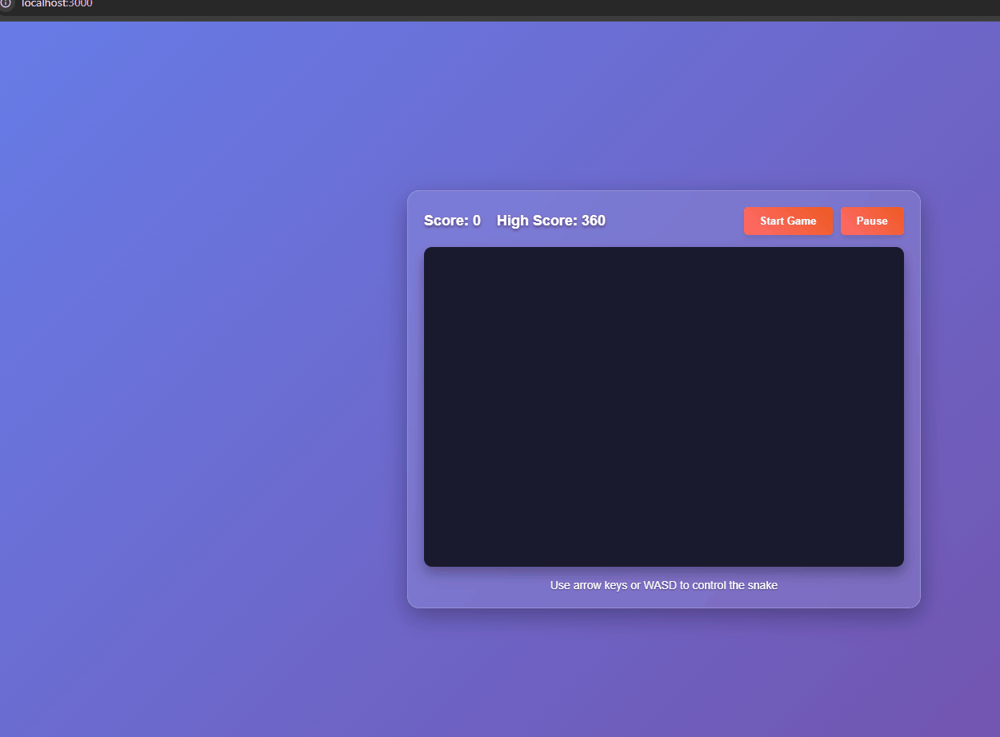

# Human Adition Here after the doc was created!





results with no human interference on code, or extra prompts only the metodology for the test.

restart game is bugged, play again not done, some js implementation is causing this issues. but looks easy to fix.

my considerations are it deliveries ok considering such a simple model running on local hardware.

# Above is all AI generated by Qwen3 Coder 30B

# Snake Game - Taco Edition

A fun implementation of the classic Snake game with a taco theme, built using HTML5 Canvas API, JavaScript (ES2020+), and CSS3.

## Features

- Classic Snake gameplay with a taco theme
- Responsive design that works on desktop and mobile
- Score tracking with high score persistence
- Level progression with increasing difficulty
- Start, pause, and game over functionality
- Smooth animations using RequestAnimationFrame
- Touch and keyboard controls

## Technology Stack

This project follows the technology stack defined in TECH_STACK.md:

- **HTML5 Canvas API** - For rendering the game board and snake movements
- **JavaScript (ES2020+)** - Primary game logic implementation
- **CSS3** - Styling and responsive design
- **No framework** - Pure vanilla JavaScript for maximum performance and control
- **Webpack** - Module bundler for development and production builds
- **Jest** - For unit testing of game logic
- **ESLint** - Code linting for JavaScript
- **Prettier** - Code formatting

## How to Run

1. Make sure you have Node.js installed
2. Open a terminal in the project directory
3. Install dependencies:
   ```bash
   npm install
   ```
4. Start the development server:
   ```bash
   npm start
   ```
5. Open your browser and go to `http://localhost:3000`

## Controls

- **Arrow keys** or **WASD** - Control the snake direction
- **Spacebar** - Pause/resume the game
- **Start Game** button - Begin a new game
- **Pause** button - Pause the game
- **Restart Game** button - Restart the game at any time

## Game Rules

- Control the snake to eat tacos (food) to grow longer and earn points
- Each taco eaten gives 10 points
- Every 50 points, the game level increases and speed increases
- Avoid hitting the walls
- Avoid colliding with the snake's own body
- The game ends when the snake hits a wall or itself

## Project Structure

```
.
├── index.html              # Main HTML file
├── package.json            # Project dependencies and scripts
├── webpack.config.js       # Webpack configuration
├── .eslintrc.json          # ESLint configuration
├── __tests__/              # Test files
│   └── game.test.js        # Game logic tests
├── src/
│   ├── js/
│   │   └── main.js         # Main game logic and implementation
│   └── css/
│       └── style.css       # Game styling
└── README.md               # This file
```

## Development

To run tests:

```bash
npm test
```

To lint code:

```bash
npm run lint
```

To build for production:

```bash
npm run build
```

## Contributing

This is a simple educational implementation of the Snake game. Feel free to fork and improve it!

## License

MIT
